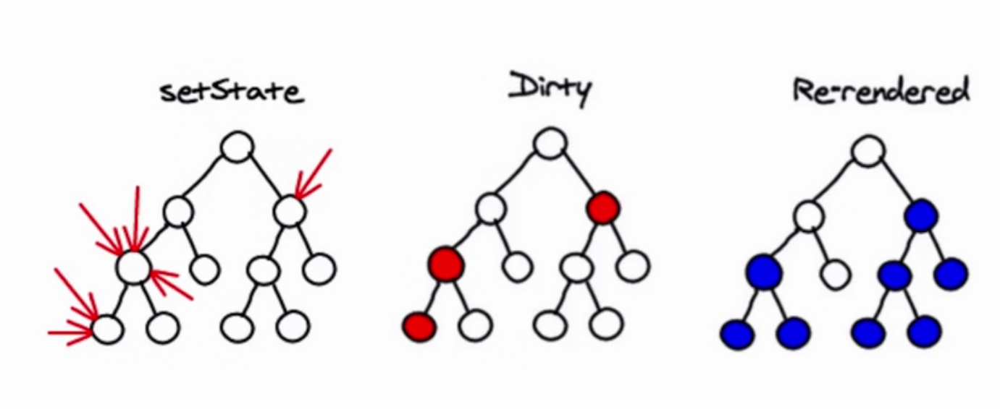
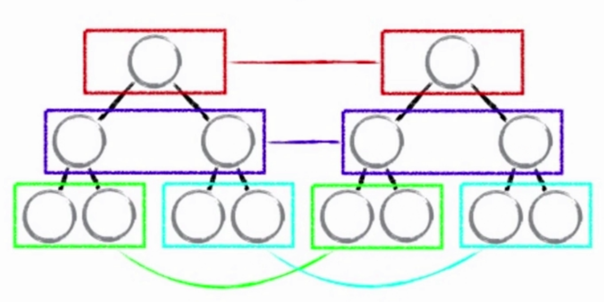
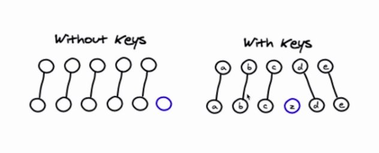

在React中最让人称道的就是它的虚拟DOM和独特的Diff算法了，它极大的提高了我们渲染页面的性能。在实际项目中我们不需要去关心虚拟DOM的运行原理，只需关注我们的数据即可，因为Diff算法会帮助我们去计算和分析虚拟DOM中变化的部分，从而去重新渲染该部分，从而实现了性能的提升，也简化了我们的操作。

<!--more-->

## 虚拟DOM原理



虚拟DOM是由`state数据`和`JSX模板`结合生成的，它的本质是一个JS对象，用它来描述真实的DOM。react会把这个虚拟DOM抽象成一个DOM树，当state数据改变，`state数据`和`JSX模板` 会生成新的虚拟DOM，通过Diff算法来对比新旧两个虚拟DOM，找到其中的不同，进而改变真实的DOM结构，来渲染页面的。

```react
// 真实dom
<div id="text">
    <span>hello word</sapn>
</div>

//虚拟dom
['div',{'id':'abc'},['span',{},'hello word']]


//在render函数中
redder(){
    return <div>Hello Word</div>
    //等同于
    return React.createElement('div',{},'item');
}

```

## 虚拟DOM中的Diff算法

 

传统 Diff 算法通过循环递归对节点进行依次对比，效率低下 ,自然达不到我们追求的性能高效的效果，react对Diff重新算法进行了优化。

react的Diff算法是将拥有相同类的两个组件生成相似的树形结构，然后对DOM树进行逐层的节点比较，并且是只会比较同一层次的节点。如图所示，它只会对相同颜色的节点经行比对。如果某一个节点发生了改变，那么它和它的子节点都会被删除，重新生成新的DOM树节点。

其中，对于同一层级的一组子节点，通过唯一id进行区分，也就是我们经常用到的`key`，新旧两个虚拟DOM通过这唯一的标识进行匹配对比。所以在项目中，我们尽量不要去用`index`去作为key值，因为在进行一些增加和删除操作中，`index`会随之变化，不是唯一的标识，这就给Diff算法带来了不便，不但在性能上增加了损耗，还可能带来一些bug。



## 总结

+ react重新优化Diff算法，更加高效
+ 分层求异，对`tree diff`进行算法优化
+ react通过相同类生成相似的树形结构，不同类生成不同树形结构，对`component diff`进行优化优化
+ 通过设置唯一标识，对`element diff`进行算法优化