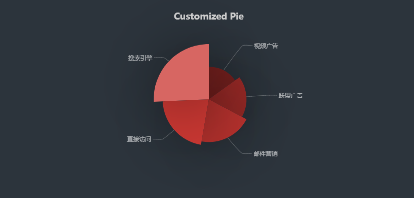

## 前言

因为angular2+ 使用 ==typescript==开发，所以想要使用echarts，必须安装echarts针对angular的插件[ ngx-echarts](https://xieziyu.github.io/ngx-echarts/#/home)。本文案列实际效果如上图。

<!--more-->

## 安装ngx-echarts

``` node
npm install echarts --save
npm install ngx-echarts@3.2.0 --save
```

**注意**

+ echarts >= 3.x
+ angular >= 6 使用 v 3.0.0 以上版本
+ angular <= 6 使用 v 2.3.1 以下版本

## 在项目中引入echarts

在angular.json文件中引入echarts.js

``` json
// angular.json 文件

{
    ...
    "build":{
    	...
        "options":{
            ...
            "scripts":[
				"node_modules/echarts/dist/echarts.min.js"
            ]
        }
    }
}
```

## 引入ngx-echarts模块

在 app.modules.ts根模块中引入 NgxEchartsModule

``` angular
// app.modules.ts

import { BrowserModule } from '@angular/platform-browser';
import { NgModule } from '@angular/core';
import { AppComponent } from './app.component';

import {NgxEchartsModule} from 'ngx-echarts'

@NgModule({
  declarations: [
    AppComponent
  ],
  imports: [
    BrowserModule,
    NgxEchartsModule
  ],
  providers: [],
  bootstrap: [AppComponent]
})
export class AppModule { }

```

## 使用

### app.component.ts

```angular
// app.component.ts

import { Component } from '@angular/core';
@Component({
  selector: 'app-root',
  templateUrl: './app.component.html',
  styleUrls: ['./app.component.css']
})
export class AppComponent {
  constructor() {}

  public chartOption={
      backgroundColor: '#2c343c',
      title: {
        text: 'Customized Pie',
        left: 'center',
        top: 20,
        textStyle: {
          color: '#ccc'
        }
      },

      tooltip: {
        trigger: 'item',
        formatter: "{a} <br/>{b} : {c} ({d}%)"
      },
      visualMap: {
        show: false,
        min: 80,
        max: 600,
        inRange: {
          colorLightness: [0, 1]
        }
      },
      series: [
        {
          name: '访问来源',
          type: 'pie',
          radius: '55%',
          center: ['50%', '50%'],
          data: [
            { value: 335, name: '直接访问' },
            { value: 310, name: '邮件营销' },
            { value: 274, name: '联盟广告' },
            { value: 235, name: '视频广告' },
            { value: 400, name: '搜索引擎' }
          ].sort(function(a, b) { return a.value - b.value; }),
          roseType: 'radius',
          label: {
            normal: {
              textStyle: {
                color: 'rgba(255, 255, 255, 0.6)'
              }
            }
          },
          labelLine: {
            normal: {
              lineStyle: {
                color: 'rgba(255, 255, 255, 0.3)'
              },
              smooth: 0.2,
              length: 10,
              length2: 20
            }
          },
          itemStyle: {
            normal: {
              color: '#c23531',
              shadowBlur: 200,
              shadowColor: 'rgba(0, 0, 0, 0.5)'
            }
          },
          animationType: 'scale',
          animationEasing: 'elasticOut',
          animationDelay: function(idx) {
            return Math.random() * 200;
          }
        }
      ]
  }

}

```

### app.component.html

```html
// app.component.html

<div echarts [options]="chartOption" class="chart"></div>
```

### app.component.css

```css
// app.component.css

.chart {
    height: 400px;
}
```


