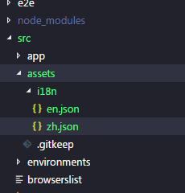
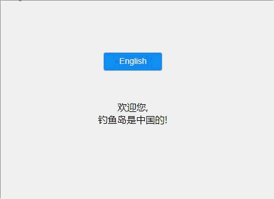

## 安装 ngx-translate模块包

```node
npm install @ngx-translate/core@9.1.1 --save
npm install @ngx-translate/http-loader --save
```

**注意：** ng6 需引入ngx-translate 10.0以上版本

<!--more-->

## 创建 i18n 语言文件

在assets文件夹下创建 国际化语言文件夹 i18n，在i18n文件夹下创建相应的语言包文件，如图：



分别创建了中文语言包 —zh.json  英文语言包—en.json，这两个语言包的数据必须是一一对应的，否则会出不来相应的效果。

```json
// zh.json
{
    "welcome":"欢迎您",
    "title":"钓鱼岛是中国的"
}

//en.json
{
    "welcome":"welcome",
    "title":"Diaoyu Island is Chinese"
}
```

## 根模块app.module.ts 导入该模块

1.导入所需要的包

```angular
import {TranslateModule, TranslateLoader} from '@ngx-translate/core';
import {TranslateHttpLoader} from '@ngx-translate/http-loader';
```

因为我们采用的是外部文件配置语言包的方法，所以还需要引入http模块

```angular
import {HttpClientModule, HttpClient} from '@angular/common/http';
```

2.模块配置

```angular
//导出加载函数
    export function createTranslateHttpLoader(http:HttpClient){
        return new TranslateHttpLoader(http, './assets/i18n/', '.json');
    }
    
    @NgModule({
        declarations: [
        AppComponent
    ],
    imports: [
    ...
        TranslateModule.forRoot({
            loader:{
            provide:TranslateLoader,
            useFactory:[createTranslateHttpLoader],
            deps:[HttpClient]
            }
        })
    ],
    providers: [],
    bootstrap: [AppComponent]
    })

```

## 子模块配置

如果采用了angular的子模块懒加载功能的话，则需要对子模块也进行配置，若没有则略过……

导入的文件包和函数配置等都是相同的，只有imports注入的时候不太一样，需要使用forChild()的方法

```angular
 @NgModule({
    ...
    imports: [
    ...
        TranslateModule.forChild({
            loader:{
            provide:TranslateLoader,
            useFactory:[createTranslateHttpLoader],
            deps:[HttpClient]
            }
        })
    ],
   	...
    })
```

## 在组件中使用

1.ts文件使用translateService服务

```angular
import { TranslateService } from '@ngx-translate/core';
@Component({
  selector: 'app-root',
  templateUrl: './app.component.html',
  styleUrls: ['./app.component.css']
})
export class AppComponent {
  title = 'app';
  en=true;
  zh=false;
  constructor(private translate:TranslateService){
    
    //添加语言支持
    translate.addLangs(["en", "zh"]);

    //设置默认语言，一般在无法匹配的时候使用
    translate.setDefaultLang('zh');
    
    //获取当前浏览器环境的语言比如en、 zh
    let browserLang = translate.getBrowserLang();
    translate.use(browserLang.match(/en|zh/) ? browserLang : 'zh');

  }

    //切换语言
    changeLang(lang) {
      this.translate.use(lang);
     
    }
}

```

2.html中使用

```html
<div style="margin-top:50px;">{{'welcome' | translate}</div>
<div>{{'title' | translate}}!</div>
```

效果：



##  订阅语言切换事件

通常某些时候我们需要在语言切换以后做一些其他的事情，这时候就需要监听语言包的改变事件了

``` angular
ngOnInit() {

    //订阅语言切换事件
    this.translate.onLangChange.subscribe((params) => {
    	// do something
 
    });
    
}
```


**至此，angualr的国际化问题就解决了，当然这只是初步的实现了语言的切换，还有更多的功能没有完善，大家可以去[ngx-translate](http://www.ngx-translate.com/)的官网查看更多的属性和方法**


