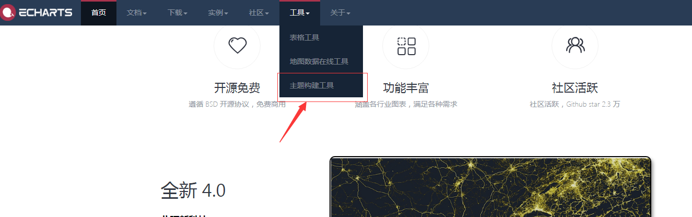
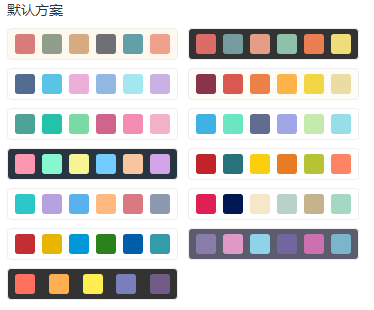
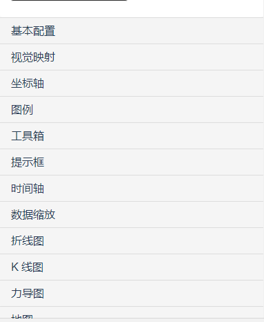
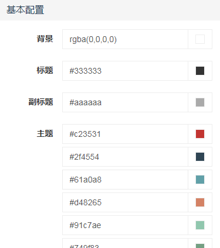
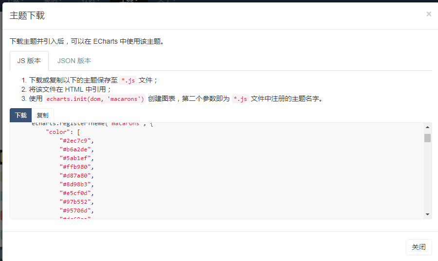
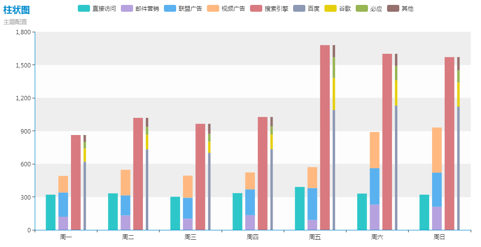
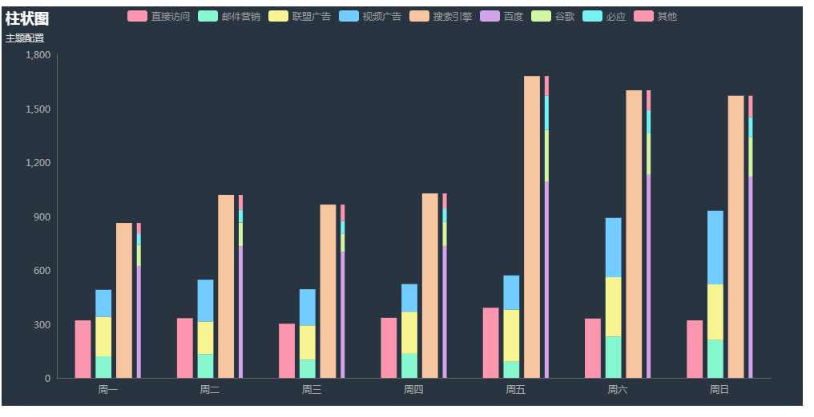

## 前言

[ECharts](http://echarts.baidu.com/index.html) 是我们在项目中经常使用的数据可视化插件，默认的主题样式基本能满足我们的需求，奈何公司的 UI 小妹妹是一个极其负责的讲究人，对颜色样式的追求是极致的 ，幸亏echarts官方为我们提供了主题配置工具，让我们轻松搞定各种样式配置。废话不多说，接下来随我一起来搞定echarts的主题配置吧……

<!--more-->

## echarts主题构建工具

首先，我们打开echarts的主题构建工具，如图：



在构建工具中有十几套主题供我们选择



如果这都满足不了你的需求，那么就自己搭配各种颜色，echarts为我们提供了基本配置、视觉、坐标轴、图例、提示框等等各个模块的样式的配置，可以说相当丰富了

**配置模块**

 

**配置项**



## 配置文件下载

主题样式配置完毕后我们需要将配置文件下载或者导出来，点击页面左上角的`下载`或者`导出`echarts很贴心的为我们提供了 **".js"**  **".json"** 两种格式的文件，本文将就js格式的配置文件为大家演示



## 引入配置文件

在项目中引进下载好的配置文件

````html
<!DOCTYPE html>
<html lang="en">
<head>
    <meta charset="UTF-8">
    <title>echats主题配置</title>
</head>
<body>
<div id="main" style="width: 1000px;height:500px;"></div>

<script src="./echarts/echarts.min.js"></script>
<script src="./echarts/macarons.js"></script>
</body>
</html>
````

## 使用

只需要我们在初始化echats时指定主题名称即可，主题名称就是主题的文件名，

````js
 // 基于准备好的dom，初始化echarts实例
    var myChart = echarts.init(document.getElementById('main'),'macarons');

    // 指定图表的配置项和数据
    var option = {
        title : {
            text: '柱状图',
            subtext: '主题配置'
        },
       	...
    };

    // 使用刚指定的配置项和数据显示图表。
    myChart.setOption(option);
````

想要改变主题样式时，只需引入不同的主题文件，并在初始化的时候改变相应的主题名字即可，效果如下：



