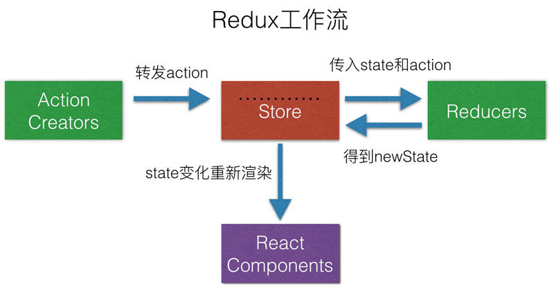

## Redux简介

Redux是JavaScript状态容器，它是一个应用数据流框架，提供可预测的状态管理。换言之，我们应用系统中的一些共享状态、共享数据都可以应用Redux来出来。应用中我们可以在任何位置通过Redux来快速的获取需要的数据，你需要做的只是告诉Redux哪个组件需要，接下来的你就不用管了，Redux会帮你搞定后面的事。是不是很方便啊，接下来让我们一起来学习 Redux吧！

<!--more-->

## Redux核心概念

Redux的核心概念有三个

> + Aciton
> + Reducer
> + Store

### Action

Action 是什么？简单的说，它就是给store传递数据的，是store的唯一数据来源。一般来说会通过  ` store.dispatch() ` 将action传递给store.

Action本质上JavaScript普通对象，在Action的对象中，我们约定使用 ` type` 字段来标识将要执行的动作。

```react
const action = {
    type: 'value_change',
    value: '123'
}
store.dispatch(action);
```

其中type的值我们可以替换成常量，当项目越来越大的时候，可以单独建一个actionTypes文件进行单独管理。

### Reducer

Reducer指定了应用状态的变化如何响应 [actions](http://www.redux.org.cn/docs/basics/Actions.html) 并发送到 store 。在react中，Rudcer就是一个纯函数，接受旧的state和action，然后返回新的state。

```react
const defaultState = {
    value: "1"
};

export default (state = defaultState, action) => {
    switch (action.type) {
        case "value_change":
            return {
                value: action.value
            }
        default:
          return state
    }
}
```

**注意：**不要修改原state.如果需要同时返回新对象和就对象，可是使用 ` Object.assign({},state,newState)` 建立新的对象，或者使用[对象展开运算符](http://es6.ruanyifeng.com/#docs/object) 创建新的对象。

```react
const defaultState = {
    value: "1"
};

export default (state = defaultState, action) => {
    switch (action.type) {
        case "value_change":
            return {
                ...state,
                userName: action.value
            }
        default:
          return state
    }
}

```

**注意：**state是唯一的，而每个reducer只负责全局state中它负责的一部分。当我们将reducer拆分，创建多个reducer后，需要我们利用 Redux提供的` combinReducers()`  将它们进行整合。

```react
import { combineReducers } from 'redux-immutable';
import { reducer as headerReducer } from '../common/header/store';
import { reducer as homeReducer } from '../pages/home/store';
import { reducer as detailReducer } from '../pages/detail/store';
import { reducer as loginReducer } from '../pages/login/store';

const reducer = combineReducers({
	header: headerReducer,
	home: homeReducer,
	detail: detailReducer,
	login: loginReducer
});

export default reducer;

```


### Store

Store对象保存应用的状态。分发状态以及注册监听。Store将Action和Reducer联系到一起。它有一下职责：

> * 维持应用的state
> * 提供 ` getState()` 方法获取state
> * 提供 `dispatch(action)`方法更新 state；
> * 通过 `subscribe(listener)` 注册监听器;
> * 通过 `subscribe(listener)` 返回的函数注销监听器。

#### Store的创建

```react
import { createStore } from 'redux'
import reducer from './reducer'

const store = createStore(reducer);

export default store;
```


#### Store的方法

##### store.getState()

组件中获取当前的state树

```react
import store form './store'
...
this.state = store.getState();
```

##### store.dispatch()

分发action,给renducer传递数据

```react
import store form './store'
...
const action = {
    type: 'value_change',
    value: '123'
}
store.dispatch(action);
```

##### store.subscribe()

监听state数据的变化

```react
store.subscribe(this.storeChange);

storeChange = ()=>{
    console.log("state数据改变了...");
} 
```

取消监听

```react
let unsubscribe = store.subscribe(this.storeChange);
unsubsrcibe();
```


##### store.replaceReducer(nextReducer)

替换 store 当前用来计算 state 的 reducer。 

##  三大原则

### 单一数据源

state是唯一的，整个应用的 state 被储存在一棵 object tree 中，并且这个 object tree 只存在于唯一一个 store 中

### State是只读的

唯一改变 state 的方法就是触发 action，action 是一个用于描述已发生事件的普通对象。

###  使用纯函数来执行修改

为了描述 action 如何改变 state tree ，你需要编写 reducer。reducer就是纯函数。

## 调试工具---redux-devtools

+ 去chorme 应用商店安装该插件

+ 在store 中进行配置

  

```react
import { createStore } from 'redux'
import reducer from './reducer'

const store = createStore(
   reducer, 
   window.__REDUX_DEVTOOLS_EXTENSION__ && window.__REDUX_DEVTOOLS_EXTENSION__()
  );

export default store; 
```


参考：[redux文档](http://www.redux.org.cn/)


